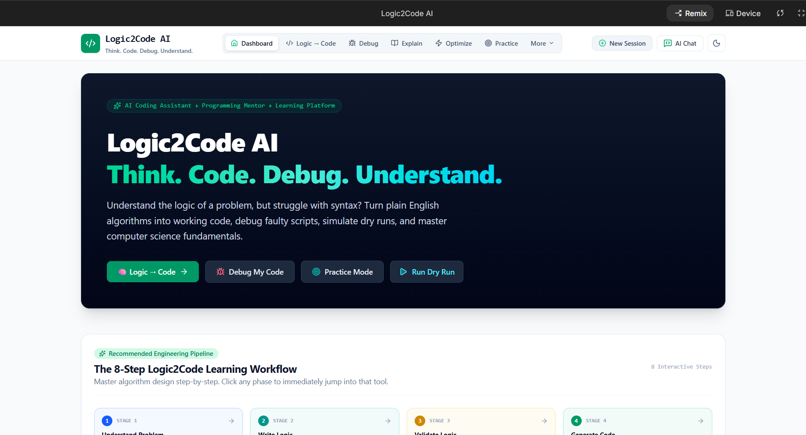
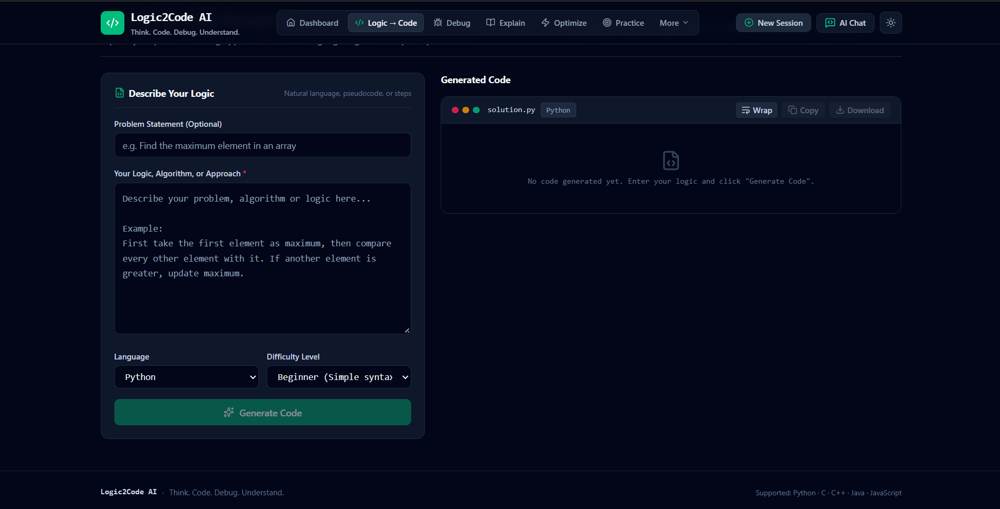
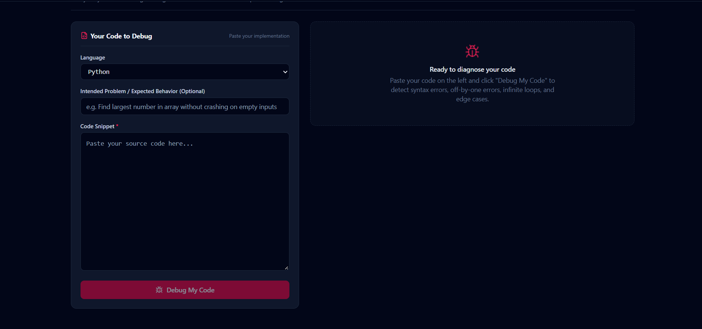
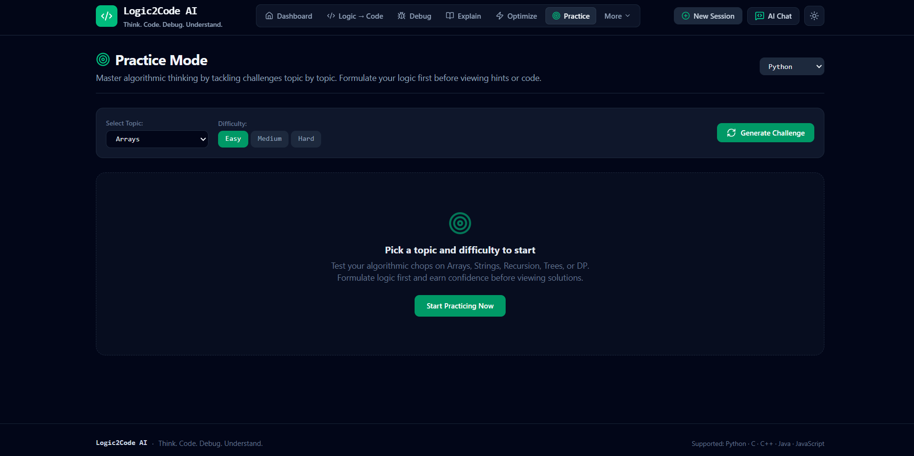

# Logic2Code AI — Your AI Programming Mentor

> **Think. Code. Debug. Understand.**

Logic2Code AI is an AI-powered programming mentor designed to help students and developers improve their programming and problem-solving skills.

It uses **Google Gemini** to convert programming logic into code, debug programs, explain code, optimize solutions, generate test cases, validate algorithms, and provide an interactive programming practice experience.

---
## 🌐 Live Demo

[**🚀 Try Logic2Code AI →**](https://logic2code-ai-700720859347.asia-southeast1.run.app)

## 🚀 Features

### 💡 Logic → Code
Convert your problem-solving logic into working code in multiple programming languages.

### 🐛 Debug Code
Find potential bugs, understand the cause of errors, and get AI-assisted corrected code.

### 📖 Explain Code
Get step-by-step explanations of code in beginner-friendly language.

### ⚡ Optimize Code
Analyze code and receive suggestions for improving efficiency, readability, and complexity.

### 🧪 Test My Code
Generate test cases and analyze possible edge cases for your program.

### ✅ Validate Logic
Check whether your proposed algorithm or logic correctly solves a given problem.

### 🔄 Logic vs Code
Compare your intended logic with the actual implementation and identify mismatches.

### 🎯 Practice Mode
Practice programming problems with:
- AI-generated problems
- Multiple difficulty levels
- Hints
- Logic checking
- Solution guidance
- Code generation

### 🔀 Code Converter
Convert code between supported programming languages.

### ▶️ Dry Run
Get an AI-generated step-by-step walkthrough of how code executes.

> **Note:** Dry Run and Test My Code provide AI/static analysis and walkthroughs. They do not execute arbitrary user code in a sandbox.

### 🔍 Combined Analysis
Analyze the problem, logic, and code together to identify mistakes and receive improvement suggestions.

### 💬 AI Chat
Ask programming-related questions and get contextual help from the AI mentor.

### 🕘 History
Save and revisit previous coding sessions and AI analyses.

### 🌙 Dark / Light Mode
Switch between dark and light themes with theme persistence.

---

## 🛠️ Tech Stack

### Frontend
- React
- TypeScript
- Vite
- Tailwind CSS

### Backend
- Node.js
- Express.js

### AI
- Google Gemini API

### Storage
- Browser LocalStorage for session/history data
## 📸 Screenshots

### Dashboard



### Logic → Code



### Debug



### Practice Mode


---

## 🏗️ Architecture

```text
User
  │
  ▼
Logic2Code AI Frontend
  │
  │ HTTP Requests
  ▼
Express Backend
  │
  ▼
Google Gemini API
  │
  ▼
AI Response
  │
  ▼
Validation & Processing
  │
  ▼
User Interface

